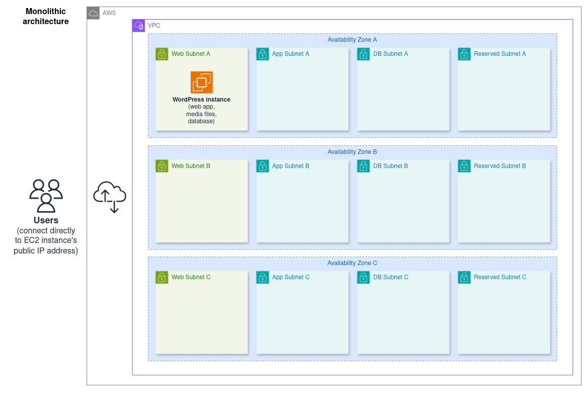

# WordPress cloud architecture 01: simple monolith

This is a single-server architecture:

- One EC2 instance in a public subnet, running WordPress' web server and database as well as storing its media files

## Elasticity and resilience overview

### Pros

- The EC2 instance can be fairly quickly reprovisioned as a larger instance if required (vertical scaling).

### Cons

- Extremely limited resilience: the instance will become completely unavailable during any outages that bring down its Availability Zone.

  A failure of the EC2 instance brings down a web server, a database, and a filesystem all at once, making the website unresponsive and possibly corrupting its data.

  The app's functionality will also be interrupted if there is a major failure on its EC2 Host machine at AWS, even if the Availability Zone itself is unaffected.

- Tightly coupled components (web server, database, and file storage) mean that none of them can be scaled independently of the others.
- Vertical scaling on EC2 can quickly get expensive; horizontal scaling is preferred.

All of the cons will be addressed as the architecture moves through different phases.

## Architectures index

1. **Simple EC2 monolith (this)**
2. **[Two-tier (EC2 and RDS)](../02_two_tier)**
3. **[Using a separate/dedicated file system (EFS)](../03_with_separate_dedicated_filesystem/)**
