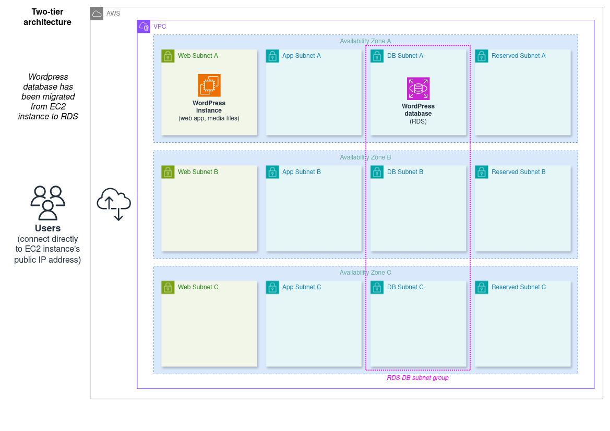

# WordPress cloud architecture 02: two-tier

This is a two-tier architecture which improves on the original monolithic setup in a few ways. It contains:

- One EC2 instance in a public subnet, running the WordPress web server as well as storing its media files
- One RDS instance in a private subnet group, running the WordPress database

## Elasticity and resilience overview

### Pros

- This keeps the benefits of the [previous](../01_simple_monolith/) architecture:
  - The web tier can be fairly quickly reprovisioned as a larger instance if required (vertical scaling).
- It also introduces a number of improvements:
  - A two-tier architecture means that we can now scale the web and db tiers independently of each other if needed.
  - RDS provides multiple options for horizontal scaling of the db tier, including Read Replicas and Multi-AZ Clusters.
  - The horizontal scaling options available in RDS can also greatly improve resilience: replicas and cluster reader instances can be located in separate Availability Zones from the primary database. Replicas specifically can be provisioned in entirely separate global Regions.

### Cons

- The web tier is still minimally resilient, with points of failure at the Availability Zone and EC2 Host levels
- This version of the web tier still only supports vertical scaling; horizontal scaling is preferred.

## Architectures index

1. **[Simple EC2 monolith](../01_simple_monolith/)**
2. **Two-tier - EC2 and RDS (this)**
3. **[Using a separate/dedicated file system (EFS)](../03_with_separate_dedicated_filesystem/)**
4. **[Using auto scaling and elastic load balancing](../04_alb_asg/)**
