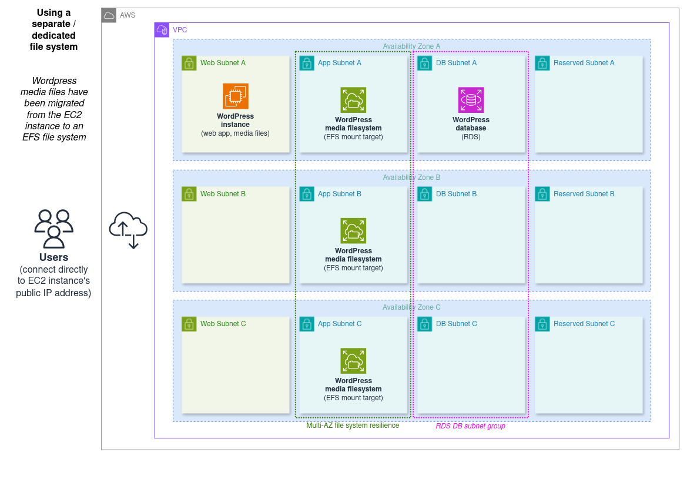

# WordPress cloud architecture 03: using a separate dedicated file system

This architecture contains:

- One EC2 instance in a public subnet, running the WordPress web server as well as storing its media files
- One RDS instance in a private subnet group, running the WordPress database
- One shared EFS (an NFS file system) which is both resilient and usable across all of the VPC's Availability Zones

## Elasticity and resilience overview

### Pros

- This keeps the benefits of the [previous](../02_two_tier/) architecture:
  - The web tier can be fairly quickly reprovisioned as a larger instance if required (vertical scaling).
  - The web tier, the db, and now the media storage can all be scaled independently of each other if needed.
  - RDS provides multiple options for horizontal scaling of the db tier, including Read Replicas and Multi-AZ Clusters.
  - The horizontal scaling options available in RDS can also greatly improve resilience: replicas and cluster reader instances can be located in separate Availability Zones from the primary database. Replicas specifically can be provisioned in entirely separate global Regions.
- The EFS migration introduces some important improvements:
  - It provides Region-wide file system resilience that can survive multiple Availability Zone outages at the same time.
  - It allows for multiple EC2 instances to share the same file system, which will be key to enabling horizontal scaling of our compute in the next step.

### Cons

- The main drawbacks of the previous architecture remain, but will now easier to address:
  - The web tier is still minimally resilient, with points of failure at the Availability Zone and EC2 Host levels
  - The web tier also still only supports vertical scaling; horizontal scaling is preferred.

## Architectures index

1. **[Simple EC2 monolith](../01_simple_monolith/)**
2. **[Two-tier - EC2 and RDS](../02_two_tier/)**
3. **Using a separate/dedicated file system (EFS) (this)**
