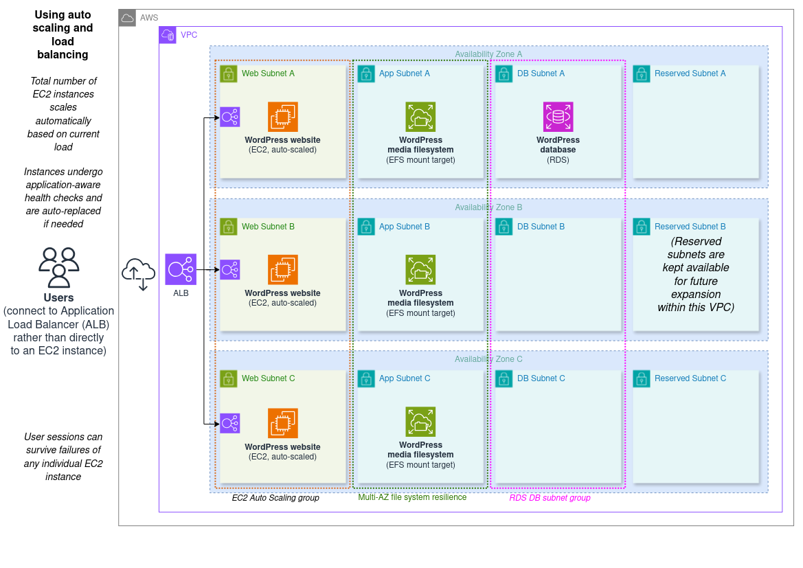

# WordPress cloud architecture 04: using auto scaling and elastic load balancing

This is the final architecture of the set. It contains:

- One auto-scaling group of WordPress website instances, which can place instances in any of the VPC's Availability Zones
- One Application Load Balancer, which accepts incoming web requests and distributes them across the currently available WordPress instances in the auto scaling group
- One RDS instance in a private subnet group, running the WordPress database
- One shared EFS (an NFS file system) which is both resilient and usable across all of the VPC's Availability Zones

## Elasticity and resilience overview

### Pros

- Some key improvements introduced in this architecture include:
  - Auto-scaling compute; EC2 instances will be dynamically added or removed in response to observed load (horizontal scaling).
  - Multi-AZ resilience is now possible in the web tier. The load balancer has nodes in all of the VPC's Availability Zones, and the auto scaling group it targets can create instances across all of those AZs.
  - Instance health checks and self-healing; all EC2 instances are regularly checked for functionality and automatically replaced if needed.

- The architecture also keeps the benefits of the [previous](../03_with_separate_dedicated_filesystem/) one:
  - The web tier, the db, and the media storage can all be scaled independently of each other if needed.
  - RDS provides multiple options for horizontal scaling of the db tier, including Read Replicas and Multi-AZ Clusters.
  - The horizontal scaling options available in RDS can also greatly improve resilience: replicas and cluster reader instances can be located in separate Availability Zones from the primary database. Replicas specifically can be provisioned in entirely separate global Regions.
  - It provides Region-wide file system resilience that can survive multiple Availability Zone outages at the same time.
  - It allows for multiple EC2 instances to share the same file system, which is key to enabling horizontal scaling of our compute instances.

### Cons

- All of the drawbacks previously listed here have been addressed.

## Architectures index

1. **[Simple EC2 monolith](../01_simple_monolith/)**
2. **[Two-tier (EC2 and RDS)](../02_two_tier)**
3. **[Using a separate/dedicated file system (EFS)](../03_with_separate_dedicated_filesystem/)**
4. **Using auto scaling and elastic load balancing (this)**
